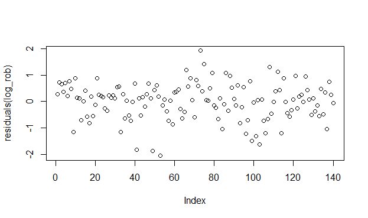
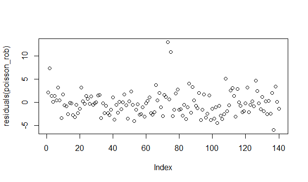
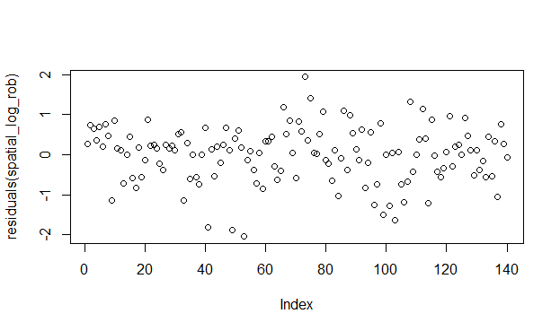

[](http://quantlet.de/)

## [](http://quantlet.de/) **Advanced Regressions** [](http://quantlet.de/)

```yaml

Name of QuantLet : Advanced Regressions


Description: Different regression approaches for count data

Keywords: regression

Author: Gabriel Blumenstock, Felix Degenhardt, Haseeb Warsi


```





### R Code
```r
####robbery#####
hist(agg.2016$robbery)
plot(density(agg.2016$robbery))
agg.2016$robbery[agg.2016$robbery == 0]
agg.2016$robbery[agg.2016$robbery == 0] <- 1

agg.2016$log.rob <- log(agg.2016$robbery)

hist(agg.2016$log.rob)
plot(density(agg.2016$log.rob))

###OLS with log-transformed variable robbery

log_rob <- lm(log.rob~male.youth+less.than.high.school+low.income+immigrants, data=r)
summary(log_rob)

plot(residuals(log_rob))

####tests for normality
library(nortest)
##H0: Normality
shapiro.test(residuals(log_rob)) 
##H0: Normality
lillie.test(residuals(log_rob))


####test for heteroscedasticity
library(lmtest)

### H0 <- homoscedasticity no heteroscedasticity 
bptest(log_rob) 


####spatial regression####
#defining neighbours
shp <- readOGR(".", "NEIGHBORHOODS_WGS84")
###based on queen approach
neigh <- poly2nb(shp, queen = TRUE)
W<-nb2listw(neigh, style="W", zero.policy=TRUE)
W
plot(W, coordinates(shp))


# moran's I test -- test whether there is spatial correlation
## H0 <- Data ist random


moran.lm <-lm.morantest(log_rob, W, alternative="two.sided")
print(moran.lm) 

spatial_log_rob  <-lagsarlm(log.rob~male.youth+less.than.high.school+low.income+immigrants, data=r, W)
summary(spatial_log_rob)
summary(log_rob)

#####poisson regression 

poisson_rob <- glm(robbery~male.youth+less.than.high.school+low.income+immigrants, family = "poisson", data = r)
summary(poisson_rob)
summary(spatial_log_rob)
summary(log_rob)


####print results as a Latex-Table
library(stargazer)

stargazer(model_robbery, log_rob, spatial_log_rob, poisson_rob,
          dep.var.labels = c("Robbery", "Robbery", "Robbery"), 
          covariate.labels = c("Male youth", "Less than High School", "Low Income Households", "Visible immigrants"), out = "models.tex")


