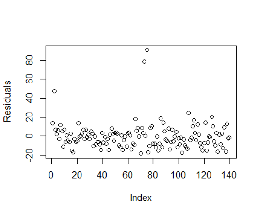
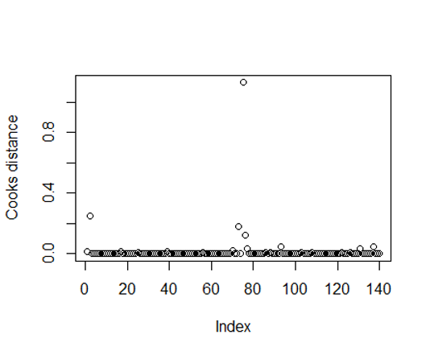

[](http://quantlet.de/)

## [](http://quantlet.de/) **Basic regression** [](http://quantlet.de/)

```yaml

Name of QuantLet : Basic regression


Description: Shows regression results for OLS where variables have not be transformed.

Keywords: regression

Author: Gabriel Blumenstock, Felix Degenhardt, Haseeb Warsi


```




### R Code
```r
#####robbery#####

###first model
model_robbery<-lm(robbery~male.youth+less.than.high.school+low.income+immigrants, data=r)
summary(model_robbery)

###influential observations - cooks distance
plot(residuals(model_robbery))
plot(cooks.distance(model_robbery))
sort(cooks.distance(model_robbery)[cooks.distance(model_robbery)>4/140], decreasing=TRUE)
r_robbery <- r[-c(75,73,9,2),]
model_robbery1<-lm(robbery~male.youth+less.than.high.school+low.income+immigrants, data=r_robbery)
summary(model_robbery1)

###variable selection - aic backwards selection
step(model_robbery)
model_robbery2<-lm(robbery~male.youth+low.income+immigrants, data=r)
summary(model_robbery2)

#check for imperfect multicollinearity
#variance inflation factors

###tests for normality
library(nortest)
shapiro.test(residuals(model_robbery))
ad.test(residuals(model_robbery))
lillie.test(residuals(model_robbery))

###tests for homoscedasticity
library(lmtest)
bptest(model_robbery)
