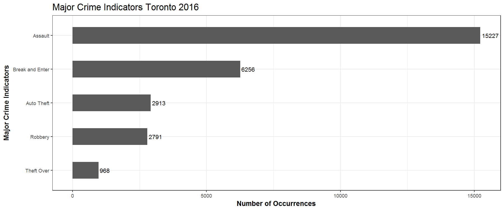

[](http://quantlet.de/)

## [](http://quantlet.de/) **Crimes by MCI** [](http://quantlet.de/)

```yaml

Name of QuantLet : Crime by MCI in Toronto 2016


Description: Plots the total crimes by MCI in Toronto 2016.

Keywords: plot, vizualization, crime

Author: Gabriel Blumenstock, Felix Degenhardt, Haseeb Warsi


```




### R Code
```r

###Group crimes by MCI
mci.group <- group_by(crime.dt, MCI)
crime.by.mci <- dplyr::summarise(mci.group, n=n()) #count of events by MCI
crime.by.mci <- crime.by.mci[order(crime.by.mci$n, decreasing = TRUE),] #order crime by type from most to least 

plot(ggplot(aes(x = reorder(MCI, n), y = n), data = crime.by.mci) +
  geom_bar(stat = 'identity', width = 0.5) +
  geom_text(aes(label = n), stat = 'identity', data = crime.by.mci, hjust = -0.1, size = 3.5) +
  coord_flip() +
  xlab('Major Crime Indicators') +
  ylab('Number of Occurrences') +
  ggtitle('Major Crime Indicators Toronto 2016') +
  theme_bw() +
  theme(plot.title = element_text(size = 16),
        axis.title = element_text(size = 12, face = "bold")))

ggsave("plots_and_images/crimes_by_MCI.png", width=12, height=5, dpi=150)

ggsave("plots_and_images/crime_by_MCI_by_month.png", width=10, height=5, dpi=150)
