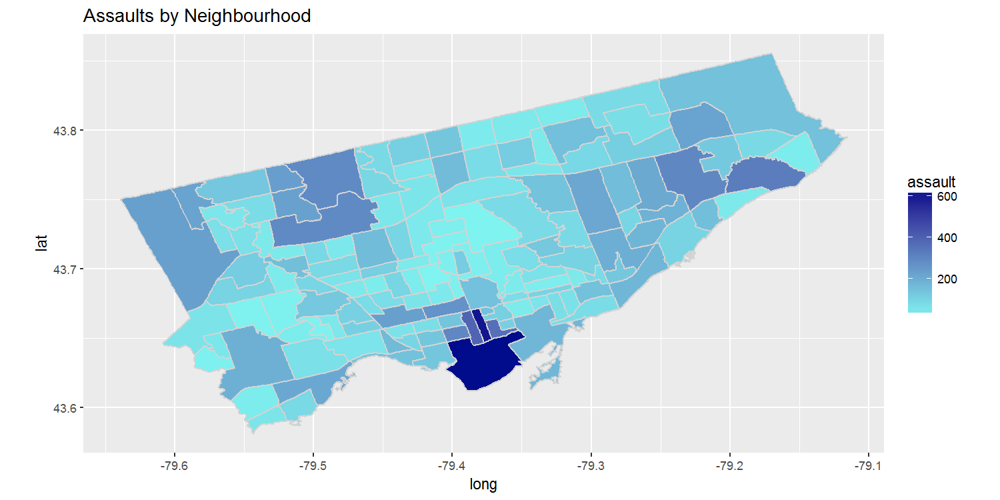
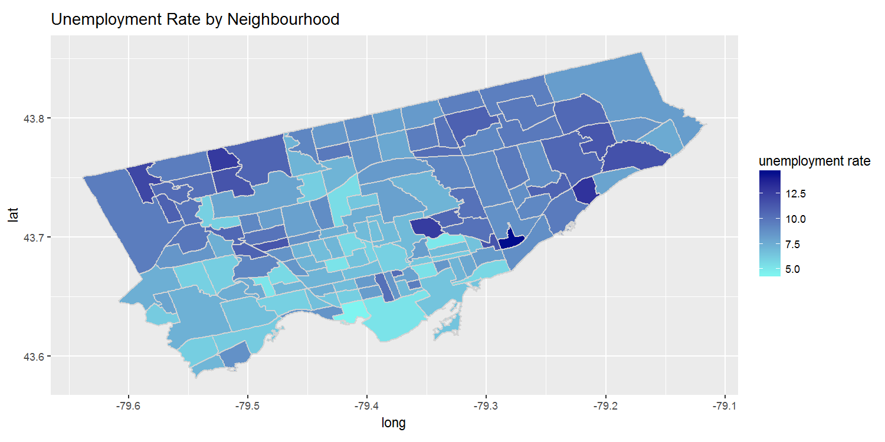

[](http://quantlet.de/)

## [](http://quantlet.de/) **Heatmaps of Selected Variables** [](http://quantlet.de/)

```yaml

Name of QuantLet : Heatmaps of Selected Variables


Description: Plots a heatmap of the specified variables.

Keywords: plot, vizualization, heatmap

Author: Gabriel Blumenstock, Felix Degenhardt, Haseeb Warsi


```





### R Code
```r
#Heatmap of toronto by population 
# Read the neighborhood shapefile data and plot
geo.data <- data.frame(agg.2016)
geo.data$Hood_ID <- str_pad(geo.data$Hood_ID, width = 3, side = 'left', pad = '0')

# the path to shape file

toronto <- readOGR(dsn = "Shapefiles/Neighbourhoods_Toronto" ,"NEIGHBORHOODS_WGS84")


# fortify and merge: muni.df is used in ggplot
toronto@data$id <- rownames(toronto@data)
toronto.geo <- fortify(toronto)
toronto.geo <- join(toronto.geo, toronto@data, by="id")
names(toronto.geo)[names(toronto.geo) == 'AREA_S_CD'] <- 'Hood_ID'

toronto.geo <- join(geo.data, toronto.geo, by = "Hood_ID")


#Define function to generate heat maps (input dataframe and desired column)
heat_map <- function(data, x) {
  plot(ggplot(data= data, aes(x=long, y=lat, group=group))  + #Choose dataframe and plot neighbourhood lines
    geom_polygon(aes_string(fill= x)) +    # draw polygons and add fill with chosen variable
    geom_path(color="light grey" ) +  # draw boundaries of neighbourhoods
    coord_equal() + 
    scale_fill_gradient(low = "#7ff4f0", high = "#000c8c",  #set colour scale
                        space = "Lab", na.value = "grey50",
                        guide = "colourbar")+
    labs(title= x))  #set title # render the map
}

#Define crime variables that will be plotted as a heatmap
crime.var <- c("total.crime", "assault", "robbery", "break.and.enter",
               "drug.arrests", "theft.over", "auto.theft")

lapply(crime.var, function(x) {heat_map(toronto.geo, x)}) #create heatmap of crime variables

#define variables from census data to be plotted as a heatmap
heat.map.var <- c( "population.2016", "male.youth", "median.income", "hholds.bottom.20per.per",
                   "low.income.pop.per", "immigrants.per", "vis.minorities.per",
                   "renters.per", "hhlds.mjr.rprs.per", "unaffordable.housing.per",
                   "unemployment.rate") #Define variables to be plotted as heat map

lapply(heat.map.var, function(x) {heat_map(toronto.geo, x)}) #create heatmap of neighbourhood variables