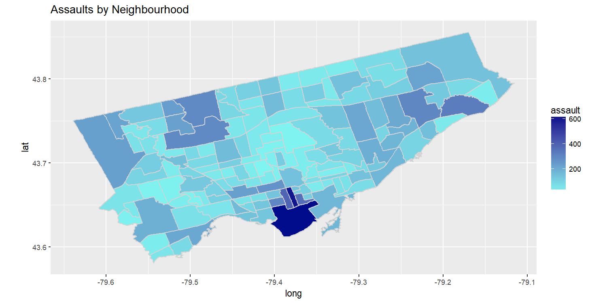

[](http://quantlet.de/)

## [](http://quantlet.de/) **Heat Map by Assault** [](http://quantlet.de/)

```yaml

Name of QuantLet : Total Crimes by Hour of Day in Toronto 2016


Description: Plots the total crimes by hour of the day in Toronto 2016.

Keywords: plot, vizualization, heatmap

Author: Gabriel Blumenstock, Felix Degenhardt, Haseeb Warsi


```




### R Code
```r
#Heatmap of toonto by population 
# Read the neighborhood shapefile data and plot

geo.data <- data.frame(agg.2016)
geo.data$Hood_ID <- str_pad(geo.data$Hood_ID, width = 3, side = 'left', pad = '0')


# the path to shape file

toronto <- readOGR(dsn = "." ,"NEIGHBORHOODS_WGS84")


# fortify and merge: muni.df is used in ggplot

toronto@data$id <- rownames(toronto@data)
toronto.geo <- fortify(toronto)
toronto.geo <- join(toronto.geo, toronto@data, by="id")
names(toronto.geo)[names(toronto.geo) == 'AREA_S_CD'] <- 'Hood_ID'

toronto.geo <- join(geo.data, toronto.geo, by = "Hood_ID")


#Plot neighbourhoods by assault

g.assault <- ggplot(data=toronto.geo, aes(x=long, y=lat, group=group))  + 
  geom_polygon(aes(fill= assault)) +    # draw polygons and add fill with assault variable
  geom_path(color="light grey" ) +  # draw boundaries of neighbourhoods
  coord_equal() + 
  scale_fill_gradient(low = "#7ff4f0", high = "#000c8c", 
                      space = "Lab", na.value = "grey50",
                      guide = "colourbar")+
  labs(title="Assaults by Neighbourhood")
print(g.assault)

ggsave("plots_and_images/heat_map_assault.png", width=10, height=5, dpi=150)
