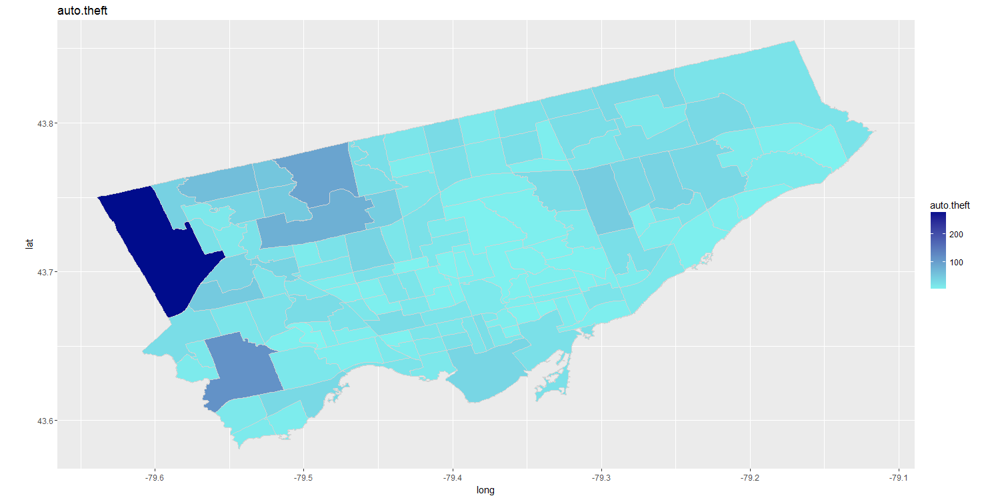
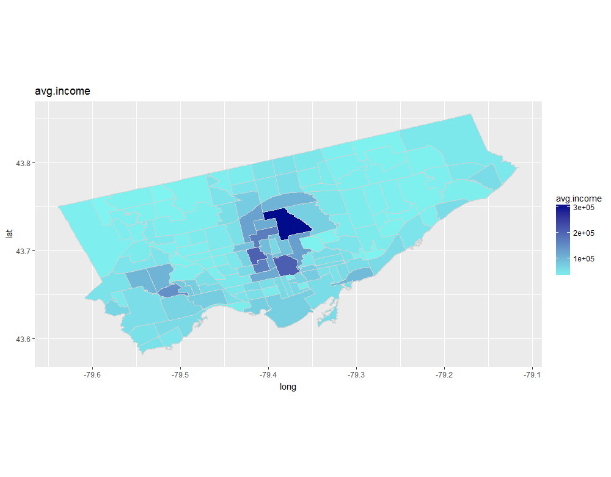
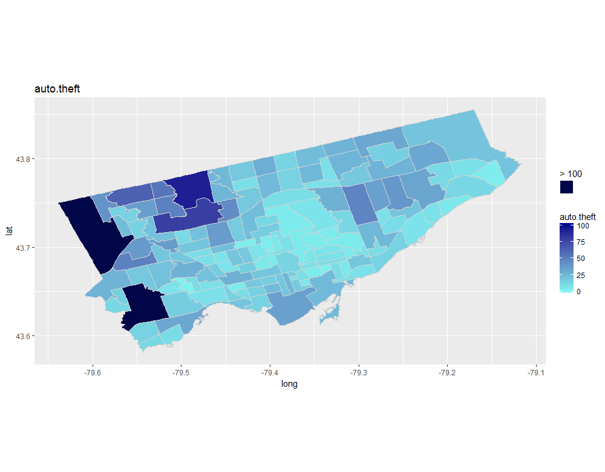
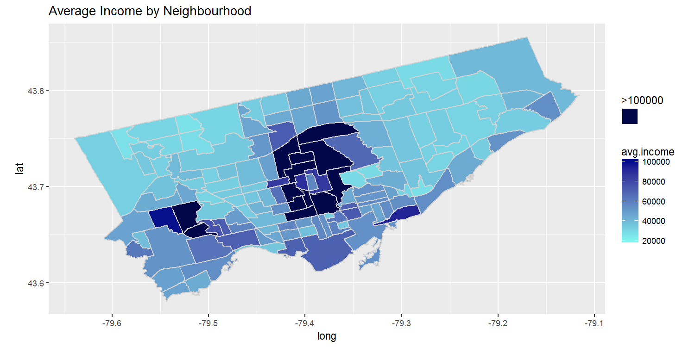

[](http://quantlet.de/)

## [](http://quantlet.de/) **Heatmaps of Selected Variables with a Limited Scale** [](http://quantlet.de/)

```yaml

Name of QuantLet : Heatmaps of Selected Variables with a Limited Scale


Description: Plots a heatmap of the specified variables and introduces an upper limit to reduce the distortion of outliers.

Keywords: plot, vizualization, heatmap

Author: Gabriel Blumenstock, Felix Degenhardt, Haseeb Warsi


```









### R Code
```r
#Define function to generate heat maps with an upper limit on scale (input dataframe and desired cluster)
#for variables with an outlier that throws off the colour scale
heat_map_limit <- function(data, x, lower, upper) {
  plot(ggplot(data=data, aes(x=long, y=lat, group=group))  + 
    geom_polygon(aes_string(fill= x, colour = shQuote(""))) +    # draw polygons and add fill with density variable
    geom_path(color="light grey" ) +  # draw boundaries of neighbourhoods
    coord_equal() + 
    scale_fill_gradient(low = "#7ff4f0", high = "#000c8c",  #Set colour scale
                        space = "Lab", 
                        na.value = "#000647", 
                        limits = c(lower, upper), #Nas are grey, set upper and lower limits of scale
                        guide = "colourbar") + #Add colour scale on side
    scale_colour_manual(values = NA) +              
    guides(colour=guide_legend(paste(">", upper, sep = " ", collapse = NULL), override.aes = list(fill="#000647"))) + #label guide
    labs(title= x)) #Add title
  
}

#plot auto thefts with an upper limit of 100 on the scale
heat_map_limit(toronto.geo, "auto.theft", 0, 100)

#plot average income of neighbourhoods with a minimum of 25 000 and maximum of 100 000 on the scale
heat_map_limit(toronto.geo, "avg.income", 25000, 100000)