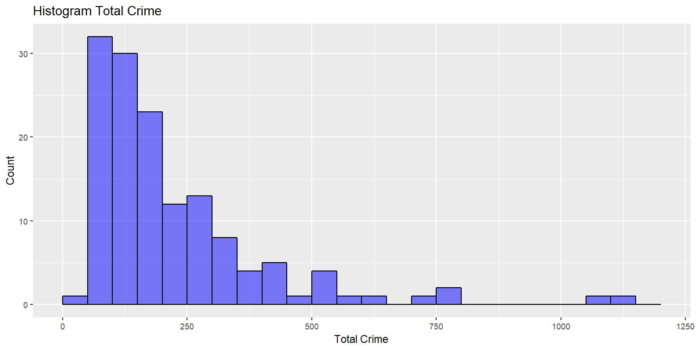

[](http://quantlet.de/)

## [](http://quantlet.de/) **Histogram of Total Crime** [](http://quantlet.de/)

```yaml

Name of QuantLet : Histogram of Total Crime


Description: Plots a histogram of the total crime in Toronto 2016.

Keywords: plot, vizualization

Author: Gabriel Blumenstock, Felix Degenhardt, Haseeb Warsi


```




### R Code
```r
####Histogram of total crime commited
print(ggplot(data=agg, aes(agg$total.crime)) + #Plot distribution of crimes committed
  geom_histogram(breaks=seq(0, 1200, by = 50), col="black", fill="blue", alpha = .5) + #Set bin width to 50
  labs(title="Histogram Total Crime") + #Add title
  labs(x="Total Crime", y="Count") + #Add x and y labels
  xlim(c(0,1200)))  #Set min and max values on x label

hist_func(agg.crime, "total.crime", 50) #create histogram of total crime, bin width of 50

ggsave("plots_and_images/hist_total_crime.png", width=10, height=5, dpi=150)