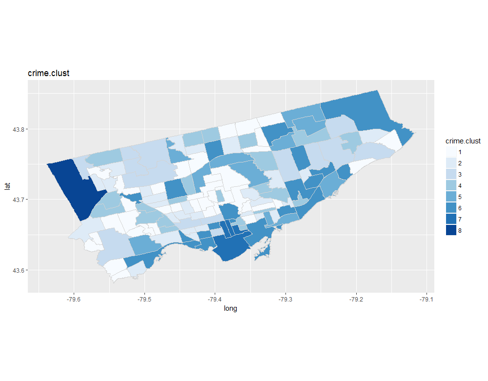

[](http://quantlet.de/)

## [](http://quantlet.de/) **k-means Clustering** [](http://quantlet.de/)

```yaml

Name of QuantLet : k-means Clustering


Description: Uses k-means clustering as well as optimal number of clusters via elbow-curve visualization.

Keywords: plot, vizualization

Author: Gabriel Blumenstock, Felix Degenhardt, Haseeb Warsi


```




### R Code
```r
###Use kmeans clustering to group neighbourhoods based on crime statistics
library("cluster")
set.seed(123)

# Test different numbers of clusters ####
# Define a vector with candidate settings for k
k.settings = 2:15

obj.values = vector(mode="numeric", length = length(k.settings))

my_kMeans <- function(data,k) {  
  clu.sol <- kmeans(data, centers=k) #function to test different number of clusters
  return(clu.sol$tot.withinss)
}

obj_values <- function(x ,title) {
  
  obj.values <- sapply(k.settings, my_kMeans, data = x) #apply kmeans function accross vect of k setings values
  
  
  k.clust <- data.frame(k.settings, obj.values)
  print(plot(ggplot(k.clust, aes(k.settings,obj.values))+
               geom_line(color = "red") + 
               geom_point(color="red")  + 
               xlab("k") + ylab("Total within-cluster SS") + 
               ggtitle(paste("Elbow curve for k selection using", title, sep = " ", collapse = NULL))))
  
}

#define crime variables
crime.vars <- c("assault", "auto.theft", "break.and.enter", "robbery", "theft.over", "drug.arrests")

#select only crime values
agg.kmeans.crime <- agg.2016[, crime.vars, with = FALSE]

#apply kmeans function to crime data set with different number of initial clusters
obj_values(agg.kmeans.crime, "crime statistics")


#Define function to label each neighbourhood with cluster label
clust_func <- function(x, no.of.clust, title) {
  kc <- kmeans(x, no.of.clust) #use optimal number of clusters
  z1 <- data.frame(x, kc$cluster) #create data frame with cluster number for each neighbourhood
  print(clusplot(z1, kc$cluster, color=TRUE, shade=F, labels=0, lines=0, main=paste('k-Means Cluster Analysis', title, sep = " ", collapse = NULL))) #cluster plot
  y <- as.factor(z1$kc.cluster)
  return(y)
}

agg.2016$crime.clust <- clust_func(agg.kmeans.crime, 8, "Crime Statistics") #join crime clusters to agg.2016 data frame


#Define function to generate heat maps for cluster variables (input dataframe and desired cluster)
heat_map_clust <- function(data, x) {
  plot(ggplot(data= data, aes(x=long, y=lat, group=group))  + 
    geom_polygon(aes_string(fill= x)) +    # draw polygons and add fill with variable
    geom_path(color="light grey" ) +  # draw boundaries of neighbourhoods
    coord_equal() +
    geom_tile() + #plot fill as geom tiles
    scale_fill_brewer(palette="Blues") + #choose colour palette
    labs(title= x))  #set title # render the map
}

#Define cluster variabes to be plotted on heat map
clust.var <- names(agg.2016[, grepl(".clust", colnames(agg.2016)), with = FALSE])

#plot cluster variables on a heatmap
lapply(clust.var, function(x) {heat_map_clust(toronto.geo, x)})