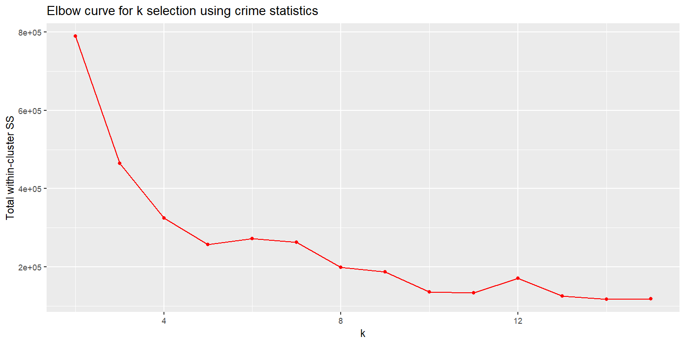

[](http://quantlet.de/)

## [](http://quantlet.de/) **k-means Clustering** [](http://quantlet.de/)

```yaml

Name of QuantLet : k-means Clustering


Description: Uses k-means clustering as well as optimal number of clusters via elbow-curve visualization.

Keywords: plot, vizualization

Author: Gabriel Blumenstock, Felix Degenhardt, Haseeb Warsi


```




### R Code
```r
###Use kmeans clustering to group neighbourhoods based on crime statistics
library("cluster")
agg.kmeans <- join(neigh.codes, agg, by = "Hood_ID")
agg.kmeans <- agg.kmeans[,-c(1,2,9)]
set.seed(123)

# Test different numbers of clusters ####
# Define a vector with candidate settings for k
k.settings = 2:15

obj.values = vector(mode="numeric", length = length(k.settings))

my_kMeans <- function(data,k) {  
  clu.sol <- kmeans(data, centers=k) 
  return(clu.sol$tot.withinss)
}
obj.values <- sapply(k.settings, my_kMeans, data = agg.kmeans)


k.clust <- data.frame(k.settings, obj.values)
plot(ggplot(k.clust, aes(k.settings,obj.values))+
  geom_line(color = "red") + 
  geom_point(color="red")  + 
  xlab("k") + ylab("Total within-cluster SS") + 
  ggtitle("Elbow curve for k selection using crime statistics"))

ggsave("plots_and_images/elbow_curve_crime_stats.png", width=10, height=5, dpi=150)

kc <- kmeans(agg.kmeans, 7)
z1 <- data.frame(agg.kmeans, kc$cluster)

clusplot(z1, kc$cluster, color=TRUE, shade=F, labels=0, lines=0, main='k-Means Cluster Analysis Crime')
agg.2016$crime.clust <- as.factor(z1$kc.cluster)
