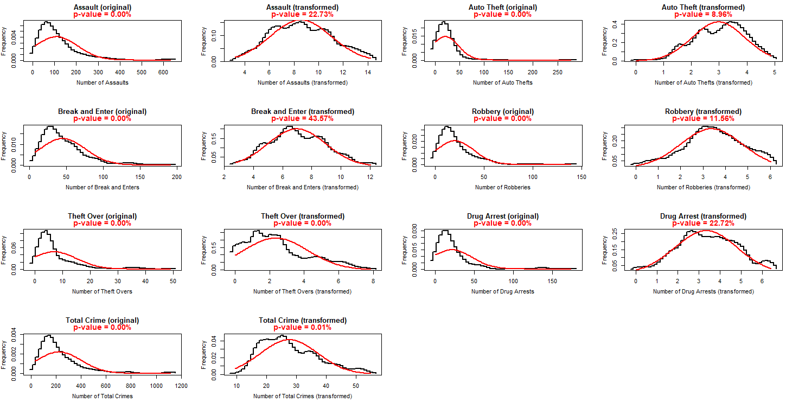

[](http://quantlet.de/)

## [](http://quantlet.de/) **Original and transformed dependent variables** [](http://quantlet.de/)

```yaml

Name of QuantLet : Minigraphs


Description: Create average shifted histograms for original and transformed dependent variables

Keywords: transformation, normal distribution

Author: Gabriel Blumenstock, Felix Degenhardt, Haseeb Warsi


```



### R Code
```r
#####PREPARATION#####
r <- as.data.frame(agg.2016)
r$obsnumber <- r$Hood_ID
swD <- function (p, x) {
  y <- bcPower(x, p)
  shapiro.test(y)$statistic
}
par(mfrow=c(4,4))

#####ASSAULT#####
#prep
i <- "assault"
r$tmp <- r[, i]
outliers <- r[r$tmp>mean(r$tmp)+2.5*IQR(r$tmp), ]$obsnumber
outliers
rtmp <- r[!r$obsnumber %in% outliers, ]
rtmp[rtmp$tmp==0, ] <- 1
exponent <- optimize(swD, c(-3,3), x=rtmp$tmp)$objective
shapiro.test(bcPower(rtmp$tmp,exponent))
rtmp$tmp.bp <- bcPower(rtmp$tmp, exponent)

#original
plot(ash1(bin1(r$tmp)), main="Assault (original)", xlab="Number of Assaults",
ylab="Frequency", type="s", mgp=c(2.5,1,0), lwd=2)
x <- seq(min(r$tmp), max(r$tmp), length.out = 100)
lines(x, dnorm(x, mean=mean(r$tmp), sd=sd(r$tmp)), col="red", lwd=2)
shapiro.test(r$tmp)$p.value
mtext("p-value = 0.00%", line=0.4, cex=0.9, col="red", font=2)
#transformed
plot(ash1(bin1(rtmp$tmp.bp)), main="Assault (transformed)",
xlab="Number of Assaults (transformed)", ylab="Frequency", type="s",
mgp=c(2.5,1,0), lwd=2)
x <- seq(min(rtmp$tmp.bp), max(rtmp$tmp.bp), length.out = 100)
lines(x, dnorm(x, mean=mean(rtmp$tmp.bp), sd=sd(rtmp$tmp.bp)), col="red", 
lwd=2)
shapiro.test(rtmp$tmp.bp)$p.value
mtext("p-value = 22.73%", line=0.4, cex=0.9, col="red", font=2)

#####AUTO.THEFT#####
#prep
i <- "auto.theft"
r$tmp <- r[, i]
outliers <- r[r$tmp>mean(r$tmp)+2.5*IQR(r$tmp), ]$obsnumber
outliers
rtmp<-r[!r$obsnumber %in% outliers, ]
rtmp[rtmp$tmp==0, ] <- 1
exponent <- optimize(swD, c(-3,3), x=rtmp$tmp)$objective
shapiro.test(bcPower(rtmp$tmp,exponent))
rtmp$tmp.bp <- bcPower(rtmp$tmp, exponent)

#original
plot(ash1(bin1(r$tmp)), main="Auto Theft (original)", 
xlab="Number of Auto Thefts", ylab="Frequency", type="s", 
mgp=c(2.5,1,0), lwd=2)
x <- seq(min(r$tmp), max(r$tmp), length.out = 100)
lines(x, dnorm(x, mean=mean(r$tmp), sd=sd(r$tmp)), col="red", lwd=2)
shapiro.test(r$tmp)$p.value
mtext("p-value = 0.00%", line=0.4, cex=0.9, col="red", font=2)
#transformed
plot(ash1(bin1(rtmp$tmp.bp)), main="Auto Theft (transformed)", 
xlab="Number of Auto Thefts (transformed)", ylab="Frequency", 
type="s", mgp=c(2.5,1,0), lwd=2)
x <- seq(min(rtmp$tmp.bp), max(rtmp$tmp.bp), length.out = 100)
lines(x, dnorm(x, mean=mean(rtmp$tmp.bp), sd=sd(rtmp$tmp.bp)), 
col="red", lwd=2)
shapiro.test(rtmp$tmp.bp)$p.value
mtext("p-value = 8.96%", line=0.4, cex=0.9, col="red", font=2)

#####BREAK.AND.ENTER#####
#prep
i <- "break.and.enter"
r$tmp <- r[, i]
outliers <- r[r$tmp>mean(r$tmp)+2.5*IQR(r$tmp), ]$obsnumber
outliers
rtmp<-r[!r$obsnumber %in% outliers, ]
rtmp[rtmp$tmp==0, ] <- 1
exponent <- optimize(swD, c(-3,3), x=rtmp$tmp)$objective
shapiro.test(bcPower(rtmp$tmp,exponent))
rtmp$tmp.bp <- bcPower(rtmp$tmp, exponent)

#original
plot(ash1(bin1(r$tmp)), main="Break and Enter (original)", 
xlab="Number of Break and Enters", ylab="Frequency", type="s", 
mgp=c(2.5,1,0), lwd=2)
x <- seq(min(r$tmp), max(r$tmp), length.out = 100)
lines(x, dnorm(x, mean=mean(r$tmp), sd=sd(r$tmp)), col="red", lwd=2)
shapiro.test(r$tmp)$p.value
mtext("p-value = 0.00%", line=0.4, cex=0.9, col="red", font=2)
#transformed
plot(ash1(bin1(rtmp$tmp.bp)), main="Break and Enter (transformed)", 
xlab="Number of Break and Enters (transformed)", ylab="Frequency", 
type="s", mgp=c(2.5,1,0), lwd=2)
x <- seq(min(rtmp$tmp.bp), max(rtmp$tmp.bp), length.out = 100)
lines(x, dnorm(x, mean=mean(rtmp$tmp.bp), sd=sd(rtmp$tmp.bp)), 
col="red", lwd=2)
shapiro.test(rtmp$tmp.bp)$p.value
mtext("p-value = 43.57%", line=0.4, cex=0.9, col="red", font=2)

#####ROBBERY#####
#prep
i <- "robbery"
r$tmp <- r[, i]
outliers <- r[r$tmp>mean(r$tmp)+2.5*IQR(r$tmp), ]$obsnumber
outliers
rtmp<-r[!r$obsnumber %in% outliers, ]
rtmp[rtmp$tmp==0, ] <- 1
exponent <- optimize(swD, c(-3,3), x=rtmp$tmp)$objective
shapiro.test(bcPower(rtmp$tmp,exponent))
rtmp$tmp.bp <- bcPower(rtmp$tmp, exponent)

#original
plot(ash1(bin1(r$tmp)), main="Robbery (original)", 
xlab="Number of Robberies", ylab="Frequency", type="s", 
mgp=c(2.5,1,0), lwd=2)
x <- seq(min(r$tmp), max(r$tmp), length.out = 100)
lines(x, dnorm(x, mean=mean(r$tmp), sd=sd(r$tmp)), col="red", lwd=2)
shapiro.test(r$tmp)$p.value
mtext("p-value = 0.00%", line=0.4, cex=0.9, col="red", font=2)
#transformed
plot(ash1(bin1(rtmp$tmp.bp)), main="Robbery (transformed)", 
xlab="Number of Robberies (transformed)", ylab="Frequency", 
type="s", mgp=c(2.5,1,0), lwd=2)
x <- seq(min(rtmp$tmp.bp), max(rtmp$tmp.bp), length.out = 100)
lines(x, dnorm(x, mean=mean(rtmp$tmp.bp), sd=sd(rtmp$tmp.bp)), col="red", lwd=2)
shapiro.test(rtmp$tmp.bp)$p.value
mtext("p-value = 11.56%", line=0.4, cex=0.9, col="red", font=2)

#####THEFT.OVER#####
#prep
i <- "theft.over"
r$tmp <- r[, i]
outliers <- r[r$tmp>mean(r$tmp)+2.5*IQR(r$tmp), ]$obsnumber
outliers
rtmp<-r[!r$obsnumber %in% outliers, ]
rtmp[rtmp$tmp==0, ] <- 1
exponent <- optimize(swD, c(-3,3), x=rtmp$tmp)$objective
shapiro.test(bcPower(rtmp$tmp,exponent))
rtmp$tmp.bp <- bcPower(rtmp$tmp, exponent)

#original
plot(ash1(bin1(r$tmp)), main="Theft Over (original)", 
xlab="Number of Theft Overs", ylab="Frequency", type="s", 
mgp=c(2.5,1,0), lwd=2)
x <- seq(min(r$tmp), max(r$tmp), length.out = 100)
lines(x, dnorm(x, mean=mean(r$tmp), sd=sd(r$tmp)), col="red", lwd=2)
shapiro.test(r$tmp)$p.value
mtext("p-value = 0.00%", line=0.4, cex=0.9, col="red", font=2)
#transformed
plot(ash1(bin1(rtmp$tmp.bp)), main="Theft Over (transformed)", 
xlab="Number of Theft Overs (transformed)", ylab="Frequency", 
type="s", mgp=c(2.5,1,0), lwd=2)
x <- seq(min(rtmp$tmp.bp), max(rtmp$tmp.bp), length.out = 100)
lines(x, dnorm(x, mean=mean(rtmp$tmp.bp), sd=sd(rtmp$tmp.bp)), 
col="red", lwd=2)
shapiro.test(rtmp$tmp.bp)$p.value
mtext("p-value = 0.00%", line=0.4, cex=0.9, col="red", font=2)

#####DRUG.ARRESTS#####
#prep
i <- "drug.arrests"
r$tmp <- r[, i]
outliers <- r[r$tmp>mean(r$tmp)+2.5*IQR(r$tmp), ]$obsnumber
outliers
rtmp<-r[!r$obsnumber %in% outliers, ]
rtmp[rtmp$tmp==0, ] <- 1
exponent <- optimize(swD, c(-3,3), x=rtmp$tmp)$objective
shapiro.test(bcPower(rtmp$tmp,exponent))
rtmp$tmp.bp <- bcPower(rtmp$tmp, exponent)

#original
plot(ash1(bin1(r$tmp)), main="Drug Arrest (original)", 
xlab="Number of Drug Arrests", ylab="Frequency", type="s", 
mgp=c(2.5,1,0), lwd=2)
x <- seq(min(r$tmp), max(r$tmp), length.out = 100)
lines(x, dnorm(x, mean=mean(r$tmp), sd=sd(r$tmp)), col="red", lwd=2)
shapiro.test(r$tmp)$p.value
mtext("p-value = 0.00%", line=0.4, cex=0.9, col="red", font=2)
#transformed
plot(ash1(bin1(rtmp$tmp.bp)), main="Drug Arrest (transformed)", 
xlab="Number of Drug Arrests (transformed)", ylab="Frequency", 
type="s", mgp=c(2.5,1,0), lwd=2)
x <- seq(min(rtmp$tmp.bp), max(rtmp$tmp.bp), length.out = 100)
lines(x, dnorm(x, mean=mean(rtmp$tmp.bp), sd=sd(rtmp$tmp.bp)), 
col="red", lwd=2)
shapiro.test(rtmp$tmp.bp)$p.value
mtext("p-value = 22.72%", line=0.4, cex=0.9, col="red", font=2)

#####TOTAL.CRIME#####
#prep
i <- "total.crime"
r$tmp <- r[, i]
outliers <- r[r$tmp>mean(r$tmp)+2.5*IQR(r$tmp), ]$obsnumber
outliers
rtmp<-r[!r$obsnumber %in% outliers, ]
rtmp[rtmp$tmp==0, ] <- 1
exponent <- optimize(swD, c(-3,3), x=rtmp$tmp)$objective
shapiro.test(bcPower(rtmp$tmp,exponent))
rtmp$tmp.bp <- bcPower(rtmp$tmp, exponent)

#original
plot(ash1(bin1(r$tmp)), main="Total Crime (original)", 
xlab="Number of Total Crimes", ylab="Frequency", type="s",
mgp=c(2.5,1,0), lwd=2)
x <- seq(min(r$tmp), max(r$tmp), length.out = 100)
lines(x, dnorm(x, mean=mean(r$tmp), sd=sd(r$tmp)), col="red", lwd=2)
shapiro.test(r$tmp)$p.value
mtext("p-value = 0.00%", line=0.4, cex=0.9, col="red", font=2)
#transformed
plot(ash1(bin1(rtmp$tmp.bp)), main="Total Crime (transformed)", 
xlab="Number of Total Crimes (transformed)", ylab="Frequency", 
type="s", mgp=c(2.5,1,0), lwd=2)
x <- seq(min(rtmp$tmp.bp), max(rtmp$tmp.bp), length.out = 100)
lines(x, dnorm(x, mean=mean(rtmp$tmp.bp), sd=sd(rtmp$tmp.bp)), 
col="red", lwd=2)
shapiro.test(rtmp$tmp.bp)$p.value
mtext("p-value = 0.01%", line=0.4, cex=0.9, col="red", font=2)
